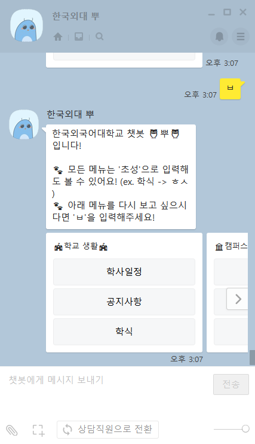
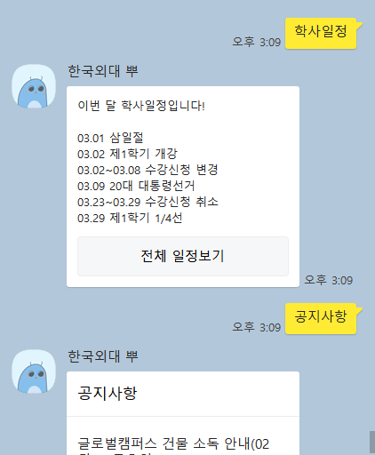
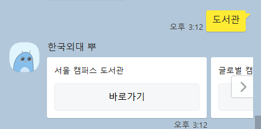

[한국외대 뿌 카카오톡 플러스 친구](https://pf.kakao.com/_xgTxnxnb)

# 한국외대 뿌🦉

## 소개

학교를 다니면서 간단한 정보 조차도 검색하거나 앱을 찾아서 접근해야 한다는 사실에 불편함을 느꼈다. 따라서 학교에 대한 정보를 손쉽게 얻기 위해 이 카카오톡 챗봇을 만들었다. 

이 카카오톡 챗봇은 한국외국어대학교에 다니는 학생들에게 유용한 정보를 제공해준다. 제공하는 기능은 다음과 같다.

학사 일정 보기, 공지사항 보기, 캠퍼스 및 건물별 학식 보기, 캠퍼스별 날씨 보기, 캠퍼스별 캠퍼스 맵 사진, 강의실 대관 바로가기, 홈페이지 바로가기, e-class 바로가기, 종합정보시스템 바로가기, 캠퍼스별 도서관 바로가기, 캠퍼스별 수강편람 바로가기, 학생 통학버스 안내 보기, 강의 시간표 바로가기

## 사용 기술

Python, Flask, Kakao I Open Builder, AWS Ec2, BeautifulSoup, Selenium

## 기능 사진

1. 인사말 및 메뉴 

2. 학사일정, 공지사항

3. 학식

4. 날씨 (초성으로 입력해도 인식)

5. 도서관

